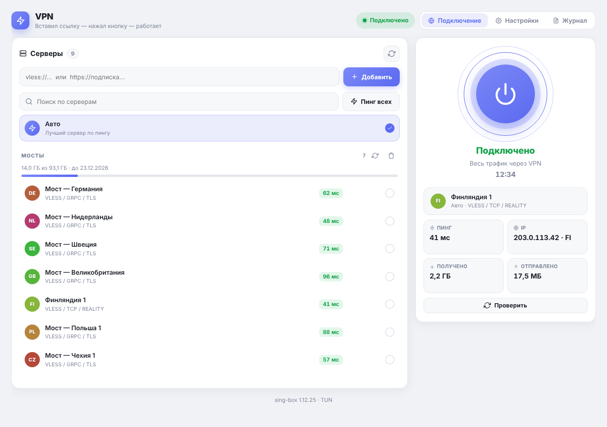
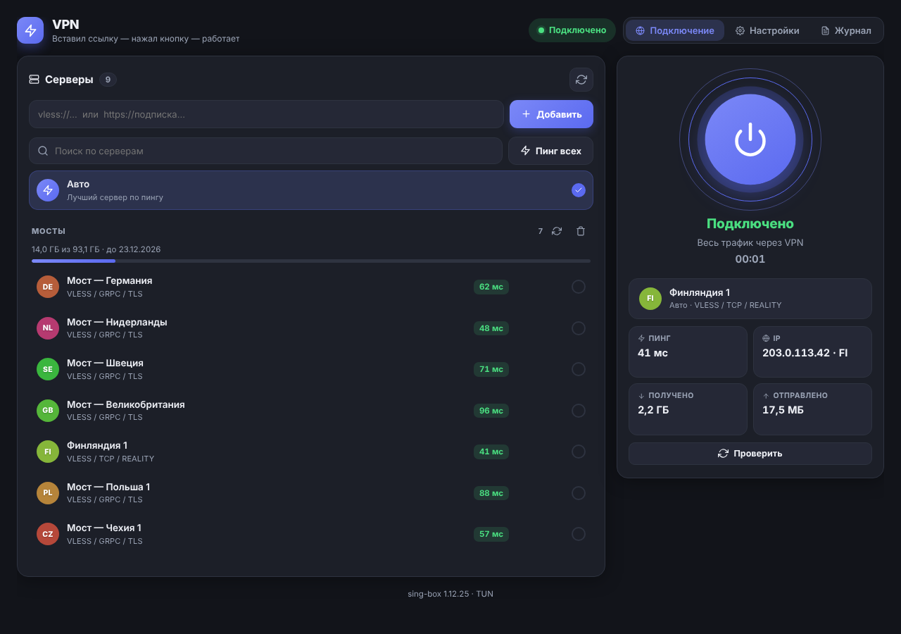
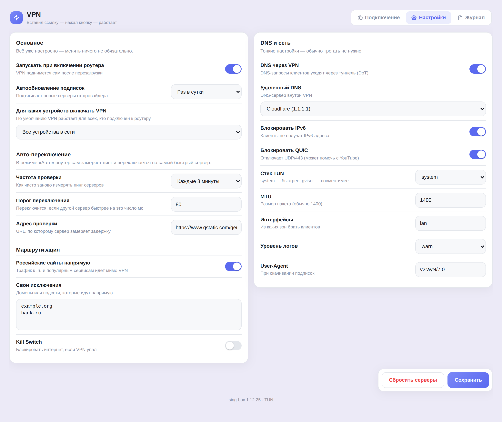
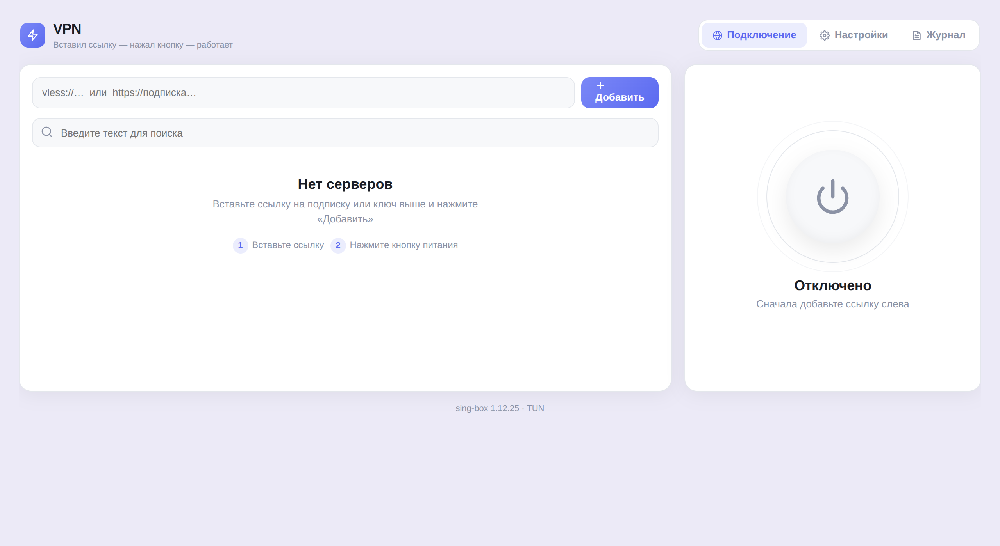
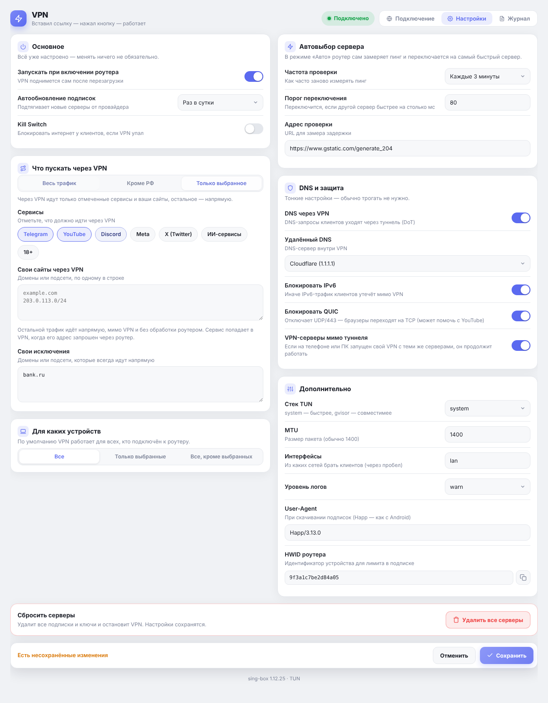
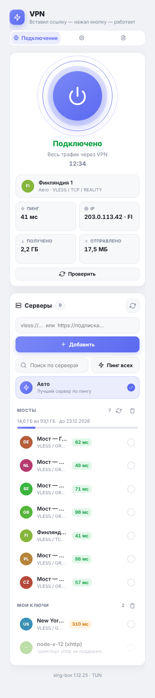

# VPN для OpenWrt

**Вставил ссылку → нажал кнопку → работает.** Красивый VPN-клиент для роутера в стиле Happ. Пункт **Службы → VPN** в LuCI.

[](https://github.com/timfdelfi/luci-app-happ/actions/workflows/ci.yml)
[](https://github.com/timfdelfi/luci-app-happ/releases)
[](LICENSE)
[](https://openwrt.org)
[](https://github.com/SagerNet/sing-box)



## Возможности

- **Без настройки.** Вставьте ссылку на подписку или ключ — всё остальное настроится само.
- **Автовыбор сервера.** Режим «Авто» сам замеряет пинг и переключается на самый быстрый сервер.
  Частота проверки, порог переключения и адрес замера настраиваются.
- **Форматы.** `vless://`, `vmess://`, `trojan://`, `ss://`, `hysteria2://`, подписки `https://…` (обычные, base64, Xray-JSON). Reality, TLS, WebSocket, gRPC, HTTPUpgrade, h2.
- **Пресеты маршрутизации.** Весь трафик, «всё, кроме российских сайтов» или «только выбранное»: Telegram, YouTube, Discord, Meta, X, ИИ-сервисы, 18+ — плюс свои сайты.
- **Информация о подписке.** Остаток трафика и срок действия, автообновление подписок.
- **Для продвинутых.** Выбор устройств, свои исключения, Kill Switch, DNS через VPN, блокировка IPv6 и QUIC, MTU, режим TUN.
- **Пинг.** Кнопка «Пинг всех» над списком, значок молнии у каждого сервера и «Пинг выбранного сервера» на карточке подключения.
- **Свой VPN на телефоне и ПК.** Трафик устройств к серверам вашей подписки идёт мимо туннеля роутера, поэтому VPN-клиент с теми же серверами на телефоне или компьютере продолжает работать (настройка «VPN-серверы мимо туннеля»).
- **Светлая и тёмная тема** — подстраивается под тему роутера, работает и с телефона.
- **Аккуратный сосед.** Свой отдельный экземпляр sing-box, `/etc/sing-box` не трогает.

## Скриншоты

| Подключено | Тёмная тема |
| --- | --- |
|  |  |
| **Настройки** | **Первый запуск** |
|  |  |

**Тёмные настройки и мобильная версия**

 

## Установка

**Windows**

1. Скачайте `happ-vpn.zip` из [Releases](https://github.com/timfdelfi/luci-app-happ/releases) и распакуйте.
2. Дважды щёлкните `INSTALL.bat`, введите адрес роутера (обычно `192.168.1.1`) и пароль root.
3. В веб-интерфейсе роутера: **Службы → VPN** (обновите страницу через Ctrl+F5).

Скрипт сам доустановит `sing-box`, `kmod-tun`, `curl`, `jq`, `ca-bundle`, `ip-full`.

**Linux / macOS / вручную**

```
scp -O happ-vpn.tar.gz root@192.168.1.1:/tmp/
ssh root@192.168.1.1 "mkdir -p /tmp/happ-vpn && tar xzf /tmp/happ-vpn.tar.gz -C /tmp/happ-vpn && sh /tmp/happ-vpn/install.sh"
```

Для OpenWrt 24.10 и старше доступен и `.ipk`: `opkg install luci-app-happ_*_all.ipk`.

**Удаление:** `sh uninstall.sh` (`--purge` — вместе с серверами).

## Как пользоваться

1. Вставьте ссылку на подписку (или ключ `vless://…`) в поле и нажмите **Добавить**.
2. Нажмите кнопку питания справа.
3. Готово. «Авто» выбирает лучший сервер сам; при желании выберите сервер вручную.

## Что пускать через VPN

В **Настройки → Маршрутизация** выберите режим:

| Режим | Что происходит |
| --- | --- |
| Весь трафик | Всё идёт через VPN (по умолчанию) |
| Всё, кроме российских сайтов | `.ru`, `.рф` и популярные российские сервисы идут напрямую |
| Только выбранные сервисы | Через VPN идут только отмеченные пресеты и ваши сайты, остальное — напрямую |

Пресеты: Telegram (домены и подсети), YouTube, Discord, Meta (Instagram, Facebook, WhatsApp, Threads), X (Twitter),
ИИ-сервисы (ChatGPT, Claude, Gemini, Perplexity, Grok), 18+. Свои сайты и подсети добавляются в поле ниже;
«Свои исключения» (всегда напрямую) имеют приоритет над пресетами.

Заметки:

- В режиме «только выбранное» остальной трафик идёт напрямую, но всё равно проходит через sing-box — на слабых роутерах скорость может быть ниже.
- Правила работают по доменам (по SNI) и, для Telegram, по подсетям. Трафик, который приложение отправляет на «голый» IP
  (например, голосовые каналы Discord), может пойти мимо VPN — добавьте нужные подсети в «Свои сайты».
- Списки доменов лежат в `root/usr/share/happ/build.jq` (`def presets`) — их легко дополнить.

## Если что-то не работает

| Симптом | Что сделать |
| --- | --- |
| Не добавляется ссылка | На роутере выполните `/usr/bin/happ selftest` — покажет, чего не хватает |
| Подписка не скачивается или «Ваш клиент не поддерживается» | Подписки скачиваются как Happ на Android (`User-Agent: Happ/3.13.0` + HWID роутера). Если панель всё равно ругается, поменяйте User-Agent в «Настройки → DNS и сеть» на актуальную версию Happ |
| Подключилось, но интернета нет | Остановите Podkop и другие VPN, смотрите вкладку **Журнал** |
| Сервер серый в списке | Он использует XHTTP, который sing-box пока не поддерживает |
| Пункта «VPN» нет в меню | Ctrl+F5, затем перелогиньтесь в LuCI |

Не помогло — [создайте issue](https://github.com/timfdelfi/luci-app-happ/issues/new/choose) и приложите вывод `selftest`. **Не публикуйте свои ссылки и ключи.**

## Как это работает

sing-box поднимает TUN-интерфейс `happ0`; трафик устройств из LAN направляется в него через `ip rule` (таблица 100), локальные сети идут мимо. DNS-запросы клиентов dnsmasq отправляет в sing-box
(127.0.0.77), и они уходят через VPN по DNS-over-TLS.

| Файл | Назначение |
| --- | --- |
| `htdocs/…/view/happ/main.js` | интерфейс (LuCI JS-view) |
| `root/usr/bin/happ` | бэкенд: подписки, конфиг, маршрутизация, DNS |
| `root/usr/share/happ/parse.jq` | разбор ссылок и подписок (без регулярок — работает на любом jq) |
| `root/usr/share/happ/build.jq` | сборка конфига sing-box |
| `root/etc/init.d/happ` | запуск через procd |
| `root/usr/libexec/rpcd/happ` | мост интерфейс ↔ бэкенд |

## Ограничения

- Роутер занимает один слот в лимите устройств вашей подписки (HWID виден в «Настройки → DNS и сеть» и в `happ selftest`).
- XHTTP (транспорт Xray) sing-box не поддерживает.
- Не запускайте одновременно с Podkop или другим VPN, который управляет маршрутизацией LAN.
- Внутри туннеля только IPv4; IPv6 клиентов блокируется во всех режимах (можно отключить).
- Нужен sing-box 1.12 или новее.

## Разработка

Для тестов нужен `jq`; `sing-box` дополнительно проверяет сгенерированный конфиг, если установлен. Для сборки нужны Bash, GNU tar и `ar` из binutils; `zip` нужен для Windows-архива. CI устанавливает необходимые инструменты и проверяет, что `.ipk` действительно является архивом `ar`.

```
sh tests/run.sh   # разбор ссылок, сборка конфига, sing-box check
sh build.sh       # dist/: happ-vpn.tar.gz и .ipk
```

Релиз: `git tag v1.1.0 && git push --tags` — GitHub Actions прогонит тесты, соберёт и прикрепит к релизу `happ-vpn.zip` (Windows), `happ-vpn.tar.gz` и `.ipk`. Версия пакета задаётся в `VERSION`; перед выпуском обновите её и поставьте соответствующий тег `v<версия>` (без номера сборки после дефиса).

Файлы в репозитории должны быть с переводами строк LF (иначе `#!/bin/sh` на роутере не запустится) — это
гарантирует `.gitattributes`; CI проверяет, что CRLF нигде нет (кроме `INSTALL.bat`).

## Лицензия

[MIT](LICENSE)
